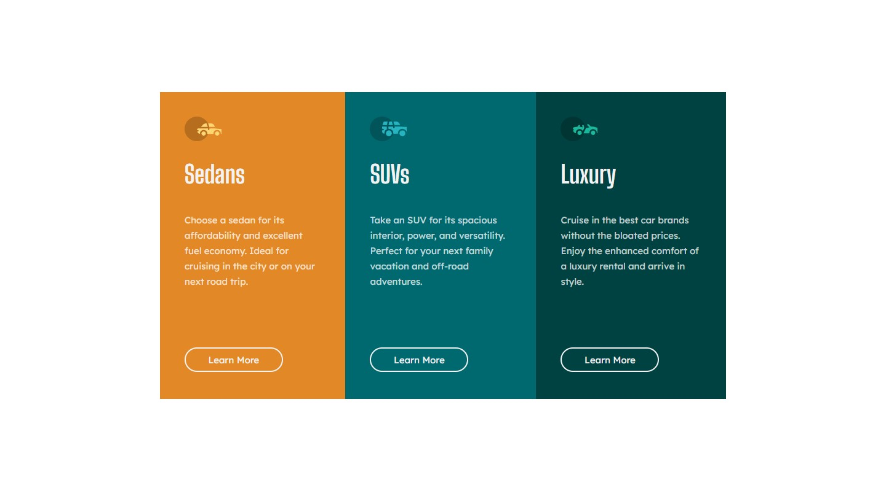

# Frontend Mentor - 3-column preview card component solution

This is a solution to the [3-column preview card component challenge on Frontend Mentor](https://www.frontendmentor.io/challenges/3column-preview-card-component-pH92eAR2-). Frontend Mentor challenges help you improve your coding skills by building realistic projects.

### The challenge

Users should be able to:

- View the optimal layout depending on their device's screen size
- See hover states for interactive elements

### Screenshot

### Links

- Live Site URL: [Add live site URL here](https://6515e6bba07e8e00a02515aa--gleeful-kitsune-bcf618.netlify.app/)

### Built with

- Semantic HTML5 markup
- CSS custom properties
- Flexbox
- Mobile-first workflow

## Author

- Website - [Campiottocodes](https://app.netlify.com/teams/campiottocodes/sites)
- Frontend Mentor - [@Campiottocodes](https://www.frontendmentor.io/profile/Campiottocodes)
- LinkedIn - [Vinicius Campiotto](https://www.linkedin.com/in/vinicius-campiotto-421233250/)
